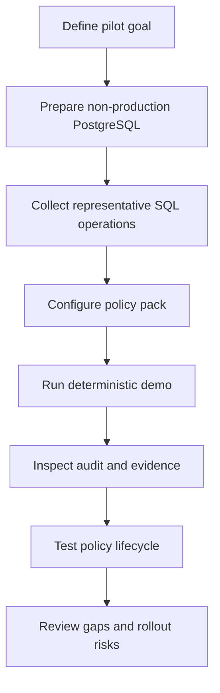

# AXIS Pilot Checklist

## Pilot Goal

Evaluate whether AXIS can enforce deterministic policy on database write paths and provide verifiable evidence for risky operations.

## Pilot Evaluation Flow

## Pre-Pilot Technical Requirements

- Test PostgreSQL instance.
- Non-production dataset.
- Representative SQL operations from applications, jobs, scripts, and migrations.
- Sample application or scripts that can send SQL through AXIS.
- Policy requirements for allowed writes, blocked writes, and approval-required writes.
- Operator contact for approval workflow testing.
- Test approval workflow participants.
- Log retention expectations.
- Agreement on acceptable latency overhead for the pilot.
- Agreement on what evidence must be reviewed after the pilot.

## Pilot Scope

- One database.
- Limited roles.
- Defined write operations.
- Defined policy pack.
- Defined approval users.
- Non-production or staging first.
- Explicit start and end criteria.

## Out of Scope for v0.6

- Broad enterprise deployment.
- Compliance attestation.
- High availability cluster.
- Multi-region policy sync.
- Full identity provider integration.
- Production-grade RBAC.
- External ledger or KMS-backed evidence.

## Success Criteria

- Risky writes are blocked or routed to approval according to policy.
- Reads are unaffected where intended.
- Audit events are generated for important decisions.
- Evidence chain verifies after normal operation.
- Policy dry-run predicts behavior for representative SQL.
- Rollback works for a stored valid policy version.
- Operators can understand decisions from the control plane.
- Reviewers can reproduce the demo without hidden setup.

## Failure Criteria

- Destructive write is allowed contrary to policy.
- Audit evidence is missing for an enforced decision.
- Evidence chain becomes unverifiable after normal operation.
- Policy activation leaves the system without a valid policy.
- Approval-required operation executes before approval.
- Approval bypass succeeds.
- Decision result is unexplained or not traceable to policy/classification.

## Review Questions

- What queries are in scope?
- What policy rules are required?
- Who approves risky writes?
- What evidence must be retained?
- What integrations are needed?
- What latency overhead is acceptable?
- Which operator actions require stronger identity controls?
- Which logs or evidence must leave the local host?
