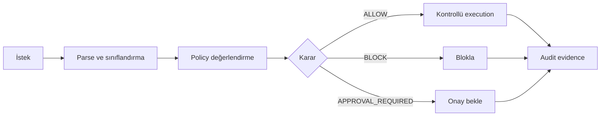

# Policy Before Execution

Policy-before-execution, AXIS'in temel güvenlik prensibidir. Türkçe karşılığıyla: işlem production'a ulaşmadan önce policy kararı verilmelidir.

Sadece "kim bağlanabilir?" sorusu yeterli değildir. Yetkili bir servis bile yanlış SQL üretebilir. Yetkili bir operatör de yanlış tenant, yanlış tablo veya geniş kapsamlı `DELETE` çalıştırabilir. AXIS bu nedenle "ne çalışmak üzere?" sorusunu execution öncesinde sorar.

## Geleneksel model

Geleneksel model çoğu zaman şu sırayla işler:

```text
identity -> access -> execution -> logs
```

Bu modelde loglar genellikle işlemden sonra oluşur. Eğer yanlış `DELETE` production'a ulaştıysa, log sadece ne olduğunu anlatır; zararı önlemez.

## AXIS modeli

AXIS modeli şu sırayı hedefler:

```text
identity/context -> operation inspection -> policy decision -> controlled execution -> evidence
```

Burada kritik fark, execution'ın policy kararından sonra gerçekleşmesidir.

## Ana akış



## Neden execution öncesi?

Execution öncesi kontrol üç sebeple önemlidir:

1. Veri değişmeden önce risk yakalanır.
2. Approval gereken operasyonlar ilk istekte çalışmaz.
3. Karar, policy metadata ve SQL fingerprint ile birlikte kanıtlanabilir.

## Mevcut implementasyondaki karşılığı

Mevcut backend'de `/query` akışı kabaca şöyledir:

1. JSON body ve request alanları doğrulanır.
2. İsteğe bağlı JWT trusted context uygulanır.
3. SQL boyutu ve rate limit kontrol edilir.
4. Prepared statement komutları ayrıca ele alınır.
5. SQL parser/classifier tek statement analiz eder.
6. `PolicyEvaluator` aktif policy ile karar üretir.
7. `Enforcer` audit decision evidence yazmadan protected write execution'a ilerlemez.
8. Karara göre PostgreSQL execution, block veya approval record oluşturulur.

## Önemli ayrım

Runtime logs operasyonel görünürlük sağlar; audit evidence ise security proof olarak düşünülür. Policy-before-execution modeli, sadece karar üretmekle kalmaz; kararın neye göre üretildiğini audit WAL içine taşır.

