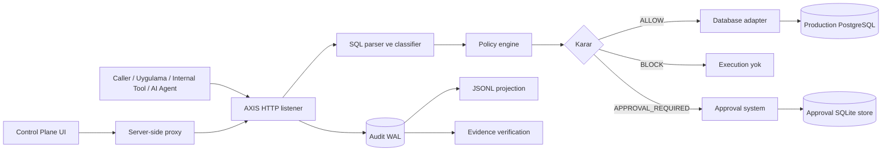

# Mimari Harita

AXIS mevcut repo yapısında Rust backend, PostgreSQL adapter, policy lifecycle, SQLite approval store, WAL tabanlı audit evidence ve Next.js Control Plane bileşenlerinden oluşur.

Ana runtime path HTTP `/query` üzerindedir. Bu, native PostgreSQL wire protocol desteği anlamına gelmez; mevcut koruma modeli HTTP adapter veya uygulama entegrasyonu ile AXIS'e yönlendirilen protected operation akışları için geçerlidir.

## Genel mimari

## Bileşenler

| Bileşen | Sorumluluk | Mevcut repo karşılığı |
|---|---|---|
| Caller | SQL isteği gönderen uygulama, tool, script veya agent | Entegrasyonlara bağlı |
| AXIS HTTP listener | `/query`, approvals, audit, policy ve runtime endpoint'leri | `src/main.rs`, `src/gate/listener.rs` |
| SQL parser/classifier | Tek statement parse, operation/scope/target/risk çıkarımı | `src/gate/classifier.rs` |
| Policy engine | Aktif policy ile deterministik karar üretimi | `src/policy/evaluator.rs` |
| Approval system | Pending approval oluşturma, approve/reject, retry proof | `src/approval/store.rs`, listener approval akışı |
| Audit WAL | Durable source of truth evidence | `src/audit/logger.rs` |
| JSONL projection | WAL sonrası operator kolaylığı için projection | `AuditLogger::with_projection` |
| Database adapter | İzin verilen SQL'i PostgreSQL'e gönderme | `src/db/postgres.rs` |
| Production PostgreSQL | Protected target veritabanı | Deployment'a bağlı |
| Control Plane UI | Operatör görünürlüğü ve proxy tabanlı yönetim | `control-plane/` |
| Policy lifecycle | manifest, SHA-256, dry-run, activation, rollback | `src/policy/manifest.rs`, `src/policy/lifecycle.rs`, `src/policy/store.rs` |

## Mimari prensipler

- Deterministik karar: AI tahmini değil, parser/classifier ve policy sonucu.
- Fail-safe: belirsiz veya desteklenmeyen şekiller güvenli tarafa çekilir.
- Evidence-first protected write: protected write öncesi audit evidence yazılamazsa execution ilerlememelidir.
- WAL canonical source: audit WAL kanıt kaynağıdır; projection ve runtime logs yardımcıdır.
- Control Plane proxy sınırı: browser doğrudan backend URL veya operator token görmemelidir.

## Uygulandı ve limit

Uygulandı:

- HTTP `/query` gate
- PostgreSQL odaklı SQL sınıflandırma
- policy manifest SHA-256 doğrulaması
- approval store ve immutable resolve davranışı
- WAL hash-chain verification
- Control Plane server-side proxy

Limit:

- Native PostgreSQL wire protocol kapsamı ayrı değerlendirilmelidir.
- AXIS'ten bypass edilen doğrudan DB write trafiği AXIS tarafından korunmaz.
- Local manifest SHA-256 remote attestation değildir.

