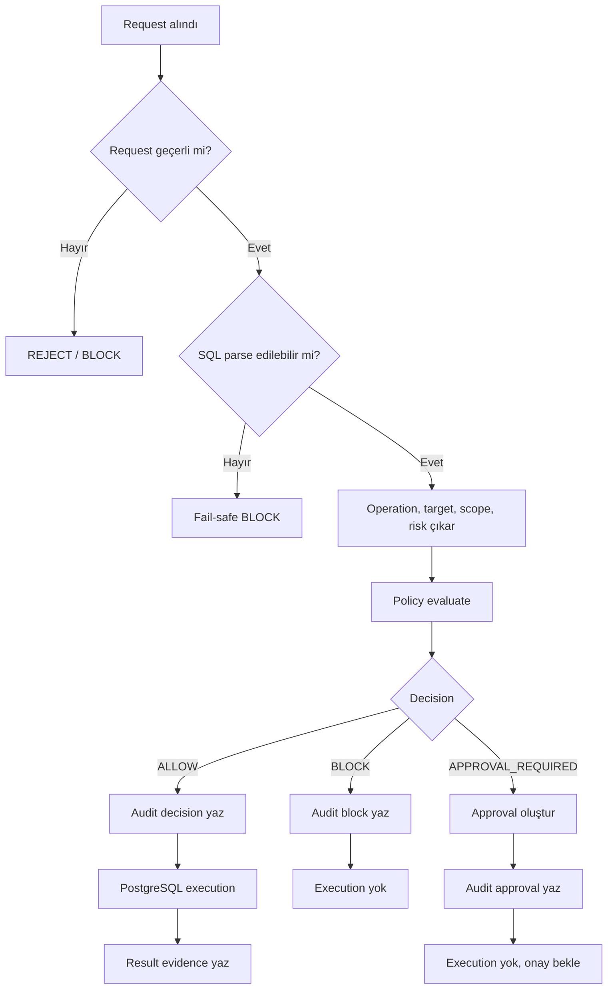

# Karar Akışı

Bir AXIS isteği önce request validation, sonra SQL classification, sonra policy evaluation adımlarından geçer. Karar verilmeden protected execution başlamaz.

## Karar akışı

## Karar modeli

| Karar | Anlam | Mevcut implementasyon notu |
|---|---|---|
| `ALLOW` | SQL execution'a gidebilir. | Protected write için decision evidence önce yazılır. |
| `BLOCK` | SQL PostgreSQL'e gönderilmez. | Policy, parser veya fail-safe nedeniyle olabilir. |
| `APPROVAL_REQUIRED` | İlk istek çalışmaz; approval kaydı oluşur. | API'de `REQUIRE_APPROVAL` olarak görünür. |
| `SUSPEND` | Kavramsal askıya alma halidir. | Ayrı policy enum'u değildir; approval bekleme, execution unknown veya manual review durumlarını anlatır. |
| `REJECT` | Approval çözümünde operatör reddidir. | Approval decision `reject`; final query decision çoğunlukla `BLOCK`, approval status `REJECTED`. |

## Örnekler

| SQL örneği | Beklenen sınıflandırma | Tipik karar | Neden |
|---|---|---|---|
| `SELECT 1` | Read | `ALLOW` | Safe read default allow olabilir. |
| `UPDATE orders SET status='x' WHERE id=1 AND tenant_id='acme'` | Scoped write | `ALLOW` veya `APPROVAL_REQUIRED` | Policy'ye bağlıdır; scoped write özel allow kuralı varsa geçebilir. |
| `UPDATE orders SET status='x'` | Batch write | `APPROVAL_REQUIRED` veya `BLOCK` | Scope geniş veya belirsizdir. |
| `DELETE FROM users` | Delete without WHERE | `BLOCK` | Kritik tablo ve geniş delete riski. |
| `DROP TABLE users` | DDL | `BLOCK` veya `APPROVAL_REQUIRED` | DDL production için kritik risk taşır. |
| `SELECT 1; DELETE FROM users` | Multi-statement | `BLOCK` | Tek istekte birden fazla statement reddedilir. |
| `PREPARE danger AS DELETE FROM users` | Prepared intent | policy'ye göre block/approval | AXIS iç SQL'i sınıflandırır, database-side PREPARE olarak kör geçirmez. |
| `EXECUTE danger` | Prepared execute | resolved ise orijinal SQL'e göre karar | Unresolved veya cross-session execute fail-safe block olur. |
| `VACUUM` veya desteklenmeyen şekil | Unsupported | `BLOCK` | Güvenli sınıflandırılamayan SQL fail-closed davranır. |

## Fail-safe davranış

Parser failure, unsupported SQL, ambiguous classification, missing context veya unresolved prepared statement gibi durumlar güvenli tarafa çekilir. Bu tür kararlar sadece runtime error gibi ele alınmaz; mümkün olduğunda audit evidence ile kaydedilir.

