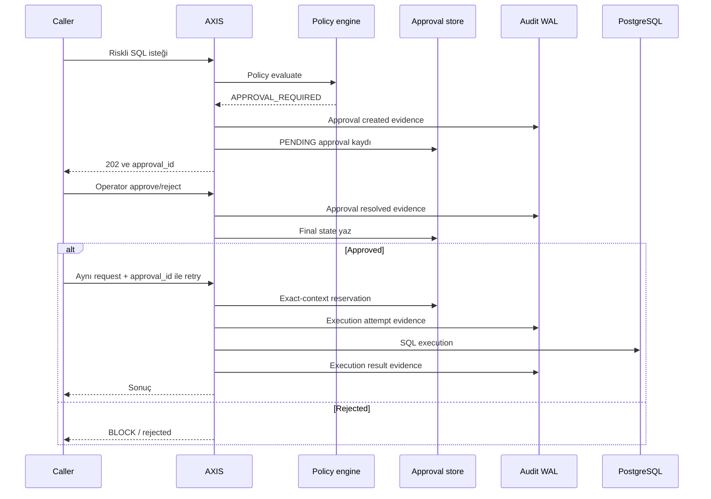

# Onay Akışı

Approval, riskli ama tamamen yasaklanması gerekmeyen operasyonları kontrollü hale getirmek için vardır. AXIS bu durumda ilk isteği çalıştırmaz; pending approval kaydı oluşturur ve audit evidence üretir.

## Approval neden var?

Bazı production işlemleri doğası gereği risklidir ama operasyonel olarak gerekli olabilir:

- geniş kapsamlı ama planlı `UPDATE`
- migration cleanup
- kontrollü DDL
- kritik tablodaki scoped ama hassas write
- AI agent veya servis tarafından üretilen write

Bu işlemleri doğrudan `ALLOW` yapmak risklidir. Her zaman `BLOCK` yapmak da operasyonu imkansız kılabilir. Approval bu iki durum arasında kontrollü bir durak sağlar.

## Yaşam döngüsü

```text
PENDING -> APPROVED -> EXECUTING -> EXECUTED
PENDING -> REJECTED
PENDING -> EXPIRED
EXECUTING -> EXECUTION_FAILED
EXECUTING -> REQUIRE_MANUAL_REVIEW
```

Mevcut store SQLite tabanlıdır. Record; request context, SQL fingerprint, classification, risk level, reason code, matched rule, policy id/version/SHA-256 ve audit event id bağlarını tutar.

## Sequence diagram



## Pending approval nasıl oluşur?

Policy `REQUIRE_APPROVAL` kararı döndürdüğünde AXIS:

1. approval id üretir,
2. expiry zamanı belirler,
3. approval creation evidence yazar,
4. SQLite approval store içine `PENDING` kayıt ekler,
5. response içinde `approval_id` ve `NOT_EXECUTED` döndürür.

Bu aşamada SQL PostgreSQL'e gönderilmez.

## Approve/reject nasıl çözülür?

`POST /approvals/:approval_id/resolve` endpoint'i approval'ı çözer. Mevcut implementation operatör token gerektirir; token yoksa veya yanlışsa güvenli hata döner.

- `approve`: kayıt `APPROVED` olur; execution hemen burada yapılmaz. Caller aynı request context ve `approval_id` ile retry yapmalıdır.
- `reject`: kayıt `REJECTED` olur; original request blocked kalır.

## Final karar neden immutable olmalıdır?

Approval resolve sonrası aynı approval tekrar çözülemez. Bunun nedeni evidence zincirinin ve operasyonel anlamın bozulmamasıdır. Bir approval önce reject sonra approve yapılabiliyorsa audit trail güvenilirliğini kaybeder.

Mevcut store `PENDING` dışındaki kayıtların tekrar resolve edilmesini reddeder. Approved retry reservation da tek kullanımlıdır; aynı approval birden fazla execution için kullanılamaz.

## Reject durumunda neden evidence gerekir?

Reject de güvenlik kararıdır. Reviewer sadece "çalışmadı" demekle yetinmemelidir. Neden çalışmadığı, kim tarafından reddedildiği, hangi original policy kararına bağlı olduğu ve hangi approval id ile ilişkili olduğu audit evidence içinde görünmelidir.

## Request, policy ve evidence bağı

Approval record şu bağları korur:

- `approval_id`
- `request_id`
- SQL fingerprint
- classification
- original reason code
- matched rule
- `policy_id`
- `policy_version`
- `policy_sha256`
- created/resolved audit event id

Bu bağlar olmadan onay kararı ayrı bir iş akışı notu olarak kalır. AXIS'te approval, request ve audit evidence aynı güvenlik modelinin parçalarıdır.

