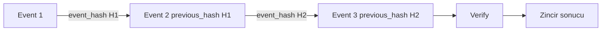

# Audit Evidence

AXIS'te audit evidence, normal logdan daha güçlü bir kavramdır. Normal log operasyonel gözlem sağlar; audit evidence ise kararın, bağlamın ve zincir bütünlüğünün doğrulanmasını hedefler.

## Normal log neden yetmez?

Runtime loglar faydalıdır ama sınırlıdır:

- bellekte tutulabilir ve restart sonrası kaybolabilir,
- kapasite dolunca eski kayıtlar düşebilir,
- hash-chain kanıtı taşımaz,
- security proof olarak source of truth değildir.

AXIS runtime logs bu yüzden "operasyonel görünürlük" olarak ele alınır. Güvenlik kanıtı için audit WAL kullanılmalıdır.

## Audit evidence ne demektir?

Audit evidence, kritik decision veya execution olayı için şu bilgilerin kaydedilmesidir:

- request id
- actor, app, tenant, role, host, env
- SQL fingerprint ve normalize edilmiş SQL
- operation, query type, target, scope
- risk signals
- policy decision ve final decision
- reason code ve matched rule
- `policy_id`, `policy_version`, `policy_sha256`
- approval id varsa approval bağı
- execution status
- `previous_hash`
- `event_hash`

## WAL neden source of truth?

WAL, write-ahead log anlamında kullanılır. AXIS audit WAL'ı append-only JSON line kayıtlarından oluşur ve evidence için canonical source kabul edilir.

Mevcut backend'de audit visibility WAL'dan okur. JSONL projection ise WAL commit sonrası yazılan yardımcı bir projection'dır. Projection başarısız olursa WAL başarısı iptal edilmez; projection health degraded olabilir.

## JSONL projection ne işe yarar?

JSONL projection, operatör görünürlüğü ve pratik inceleme için yardımcıdır. Ancak security proof olarak WAL'ın yerini almaz.

| Katman | Rol |
|---|---|
| Audit WAL | Evidence source of truth |
| JSONL projection | Operator convenience |
| Runtime logs | Kısa ömürlü operasyonel özet |
| Audit derived index | Arama ve sayfalama için rebuild edilebilir index |

## `event_hash` nedir?

`event_hash`, audit event içeriğinin canonical formu üzerinden hesaplanan SHA-256 hash değeridir. Event'in gövdesi değişirse recompute edilen hash, kaydedilmiş `event_hash` ile eşleşmez.

## `previous_hash` nedir?

`previous_hash`, bir önceki audit event'in `event_hash` değeridir. İlk event için genesis convention olarak null olabilir.

Bu alan event'leri zincir haline getirir:

```text
Event 1: previous_hash = null
Event 1: event_hash = H1

Event 2: previous_hash = H1
Event 2: event_hash = H2

Event 3: previous_hash = H2
Event 3: event_hash = H3
```

## Hash-chain continuity

Hash-chain continuity, her event'in önceki event hash'ini doğru göstermesidir. Bir kayıt silinir, taşınır veya değiştirilirse zincir kopar.



## Restart continuity neden önemli?

AXIS restart olduğunda WAL'ın son geçerli event hash'ini okur ve yeni event için `previous_hash` olarak onu kullanır. Bu davranış olmazsa restart sonrası evidence zinciri kopar veya yeni genesis başlatılmış gibi görünür.

Mevcut `AuditLogger` startup sırasında WAL'ı okuyup son hash'i yükler. Corrupt WAL startup'ta fail-fast davranışa yol açar.

## Tamper detection nasıl düşünülür?

Tamper detection, şu durumları yakalamayı hedefler:

- event gövdesi değişti,
- `event_hash` eksik,
- `previous_hash` eksik,
- hash zinciri yanlış sıraya geldi,
- JSON record bozuk,
- canonicalization hatası oluştu.

Bu model local dosya bütünlüğü sağlar; harici append-only ledger veya remote attestation iddiası değildir.

## Audit verification neyi kanıtlar?

`/evidence/verify` ve `/audit/verify` benzeri endpoint'ler hash-chain continuity ve event hash doğruluğunu kontrol eder. Başarılı verification şunu söyler:

- okunan WAL kayıtları kendi içinde hash olarak tutarlı,
- event gövdeleri kaydedilmiş hash ile uyumlu,
- zincir kopmamış.

Şunu kanıtlamaz:

- actor'ın iş niyeti doğruydu,
- external ticket doğruydu,
- database state business açısından doğru,
- local host tamamen güvenilirdi,
- remote attestation yapıldı.

## Evidence export ne işe yarar?

Evidence export, seçilmiş audit event'leri ve verification metadata'yı taşınabilir bir bundle içine koyar. Repo'da Evidence Bundle V1 ve offline verification script'leri bulunur. Evidence signing için Ed25519 destekleyen kod da vardır; signing etkin değilse bundle bunu `disabled` veya `none` olarak dürüstçe raporlamalıdır.

Bu, compliance certification değildir. Reviewer'a inceleme ve doğrulama materyali sağlar.

## Policy metadata neden evidence içine girer?

Karar tek başına yeterli değildir. Reviewer "hangi policy ile bu karar verildi?" sorusunu sorabilmelidir.

Bu yüzden evidence içinde şu alanlar önemlidir:

| Alan | Anlam |
|---|---|
| `policy_id` | Policy kimliği |
| `policy_version` | Policy versiyonu |
| `policy_sha256` | Active policy dosyasının raw SHA-256 değeri |

Policy değişiklikleri write-path davranışını değiştirdiği için karar anındaki policy metadata evidence içinde taşınmalıdır.

## Basitleştirilmiş audit event örneği

```json
{
  "event_type": "decision_made",
  "request_id": "req-123",
  "actor": "service-a",
  "app": "orders-api",
  "tenant": "acme",
  "env": "prod",
  "sql_fingerprint": "abc123...",
  "decision": "BLOCK",
  "policy_decision": "BLOCK",
  "reason_code": "bulk_delete_without_where",
  "matched_rule": "prod.bulk_delete_guard",
  "policy_id": "axis-prod-main",
  "policy_version": "prod_main@2026-05-01.1",
  "policy_sha256": "64-hex-karakter...",
  "previous_hash": "onceki-event-hash",
  "event_hash": "bu-event-hash"
}
```

Gerçek event yapısı daha fazla alan içerir ve raw SQL değerlerini redaction kurallarına göre sınırlar.

