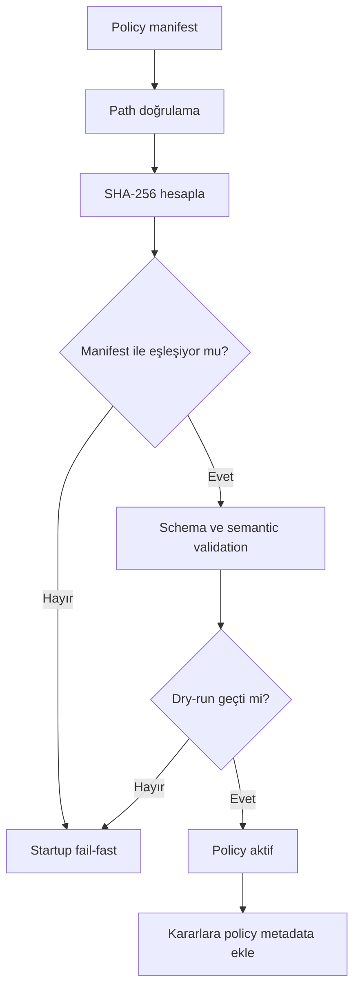

# Policy Yaşam Döngüsü ve Bütünlük

Policy dosyası production write-path davranışını belirler. Bu yüzden policy değişikliği normal config değişikliği gibi değil, güvenlik açısından kritik bir operasyon gibi ele alınmalıdır.

## Manifest-authoritative startup

Mevcut v0.9 modelinde `policies/policy_manifest.json` başlangıç için authoritative kaynaktır. Manifest şu bilgileri taşır:

- `manifest_version`
- `active_policy`
- `policy_id`
- `policy_version`
- `sha256`
- opsiyonel environment ve rollback metadata

AXIS, active policy dosyasını policy dizinine göre çözer ve path traversal gibi durumları reddeder.

## SHA-256 doğrulaması

Manifest içindeki `sha256`, active policy dosyasının raw byte içeriği üzerinden hesaplanır. AXIS startup sırasında dosyayı okur, SHA-256 hesaplar ve manifest ile karşılaştırır.

Bu kontrol şunu sağlar:

- yanlış dosya yüklenmesi yakalanır,
- local policy dosyasında beklenmeyen değişiklik yakalanır,
- policy_version mismatch yakalanır.

Bu kontrol şunu sağlamaz:

- remote attestation,
- asymmetric signature,
- distributed consensus,
- HSM/KMS backed trust.

## Startup policy validation

Başlangıçta:

1. manifest okunur,
2. path doğrulanır,
3. SHA-256 kontrol edilir,
4. JSON schema ve semantic validation yapılır,
5. policy version manifest ile karşılaştırılır,
6. activation dry-run corpus çalışır,
7. başarılıysa policy metadata runtime kararlarına taşınır.

## Dry-run

Dry-run, policy'nin temsilci SQL corpus üzerinde ne karar vereceğini gösterir. Önemli nokta: dry-run execution yapmaz, audit event yazmaz ve approval oluşturmaz.

Başlangıç dry-run corpus içinde safe read, scoped update, unsafe delete, bulk update/delete, DDL, unsupported SQL ve multi-statement gibi örnekler bulunur.

## Activation

Policy lifecycle endpoint'leri candidate policy oluşturma, validation, diff, dry-run, activation ve rollback akışlarını destekler. Mutating lifecycle endpoint'leri operator token gerektirir.

Activation için beklenen güvenlik kontrolleri:

- candidate mevcut olmalı,
- expected hash eşleşmeli,
- policy tekrar validate edilmeli,
- eski policy sessizce silinmemeli,
- audit evidence yazılmalı.

## Rollback

Rollback, önceki valid policy versiyonuna dönme mekanizmasıdır. Rollback de write-path davranışını değiştirdiği için security-sensitive kabul edilmelidir.

## Reload

Mevcut kaynakta manifest reload fonksiyonu vardır; ancak HTTP reload endpoint'i açılmamıştır ve `AXIS_ENABLE_POLICY_RELOAD=false` varsayılanı ile disabled durumdadır. Bu nedenle reload kavramı implementation içinde kontrollü gelecek yol olarak düşünülmelidir, genel unauthenticated runtime reload olarak sunulmamalıdır.

## Eski policy neden korunmalı?

Reviewer veya incident responder şu soruları sorabilir:

- Hangi policy ile karar verildi?
- O policy daha sonra değişti mi?
- Önceki policy'ye dönmek mümkün mü?
- Policy değişikliği write-path riskini artırdı mı?

Eski policy kayıtları bu yüzden sadece temizlik yükü değildir; audit ve rollback için gereklidir.

## Policy metadata propagation

Karar response'larında ve audit evidence içinde şu metadata bulunmalıdır:

- `policy_id`
- `policy_version`
- `policy_sha256`

Bu alanlar decision, approval ve evidence zincirinin aynı policy state'e bağlanmasını sağlar.

