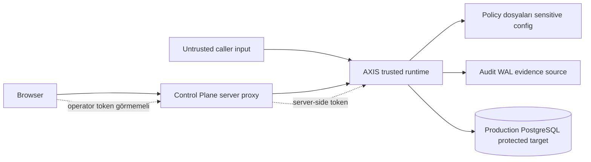

# Güven Sınırları

AXIS'in güvenlik modeli, hangi bileşenin trusted, hangi girdinin untrusted olduğunu açıkça ayırmayı gerektirir. Bu ayrım yapılmazsa doğru çalışan AXIS bile yanlış deployment nedeniyle zayıflar.

## Genel trust boundary

## Trusted kabul edilenler

Deployment varsayımı altında trusted kabul edilenler:

- AXIS process host
- AXIS runtime binary ve config
- active policy manifest ve policy dosyaları
- audit WAL dosyasına append yapan AXIS process
- approval SQLite store
- server-side Control Plane proxy
- PostgreSQL credentials'in AXIS tarafında güvenli tutulması

Bu trust, sınırsız değildir. Host compromise olursa local WAL ve policy dosyaları da risk altındadır. AXIS local manifest SHA-256 ile remote attestation iddiası yapmaz.

## Untrusted kabul edilenler

Untrusted veya doğrulanması gereken girdiler:

- request body içindeki actor/app/tenant/role/env alanları
- raw SQL
- SQL parameters
- browser input
- client tarafında gelen backend URL
- browser tarafında taşınan operator token
- AXIS'i bypass eden doğrudan DB path

JWT trusted context etkinse AXIS identity alanlarını token'dan türetebilir; aksi halde body alanları deployment tarafından doğrulanmadıkça spoofable kabul edilmelidir.

## Browser operator token görmemeli

Control Plane browser kodu `AXIS_OPERATOR_TOKEN` veya `AXIS_BACKEND_URL` almamalıdır. Mevcut Control Plane, `/api/axis/...` server-side proxy kullanır. Proxy backend URL'yi server environment'tan okur ve operator token'ı gerekli endpoint'lere server-side ekler.

Bu sınır kritik önemdedir:

- Browser token görürse token sızıntı yüzeyi büyür.
- Browser backend URL kontrol ederse SSRF veya yanlış backend routing riski oluşur.
- Client sadece local proxy path çağırmalıdır.

## Control Plane proxy sınırı

Control Plane proxy:

- route allowlist uygular,
- path segment validation yapar,
- JSON content-type bekler,
- backend URL'yi server-side config'ten alır,
- token'ı server-side ekler,
- hassas detayları sanitize eder.

Bu proxy full IAM değildir. Operator identity, RBAC, SSO ve mTLS gibi kontroller production deployment'ta ayrıca tasarlanmalıdır.

## Database protected target

Production PostgreSQL protected target'tır. AXIS'ten geçmeyen direct write trafiği AXIS tarafından kontrol edilemez.

Bu yüzden production ortamda:

- uygulamalar doğrudan write-capable DB credential almamalı,
- network policy AXIS dışı write path'i kapatmalı,
- DB role separation yapılmalı,
- bypass monitoring olmalı,
- backup ve restore ayrı güvenlik kontrolü olarak korunmalı.

## Audit WAL'ın rolü

Audit WAL evidence source'tur. Runtime logs veya JSONL projection bu rolü devralmaz.

WAL için beklenen sorumluluklar:

- append path korunmalı,
- disk ve volume güvenilirliği sağlanmalı,
- backup/retention planı olmalı,
- sadece trusted process yazabilmeli,
- verification sonuçları düzenli izlenmeli.

## Policy dosyaları sensitive security configuration

Policy dosyası production write-path davranışını değiştirir. Bu nedenle:

- review edilmeden değiştirilmemeli,
- manifest SHA-256 güncellemesi bilinçli yapılmalı,
- rollback yolu korunmalı,
- candidate diff ve dry-run kullanılmalı,
- policy change audit edilmeli.

