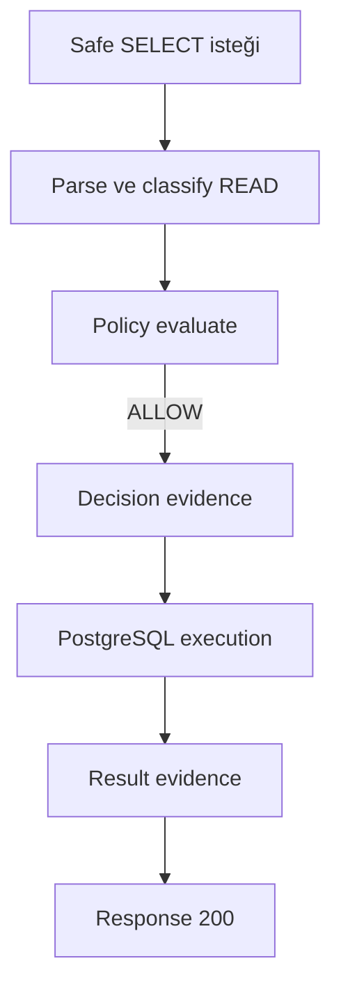
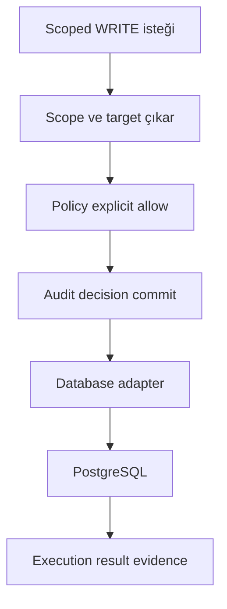
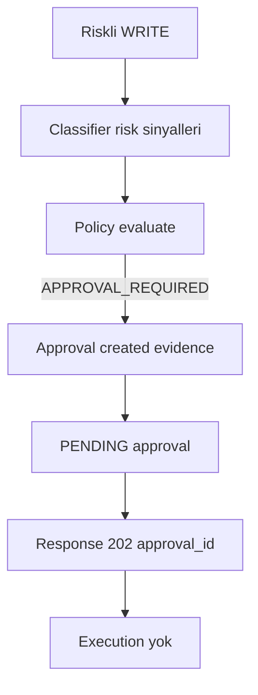
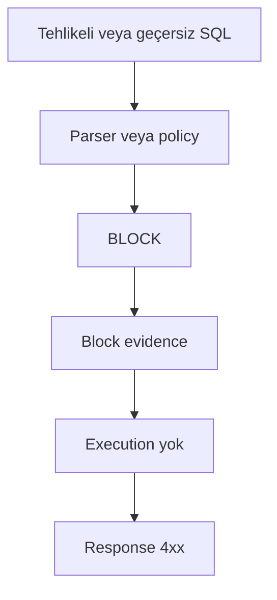
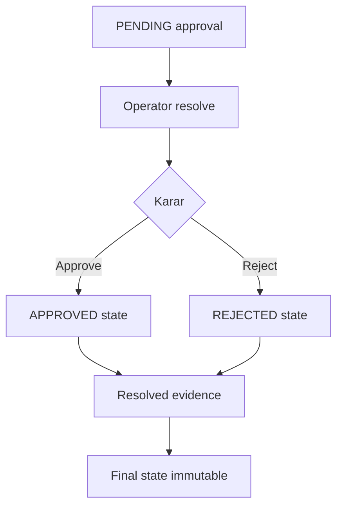
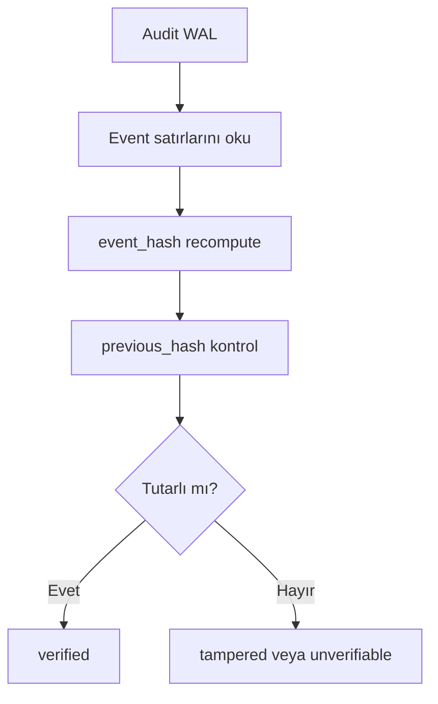
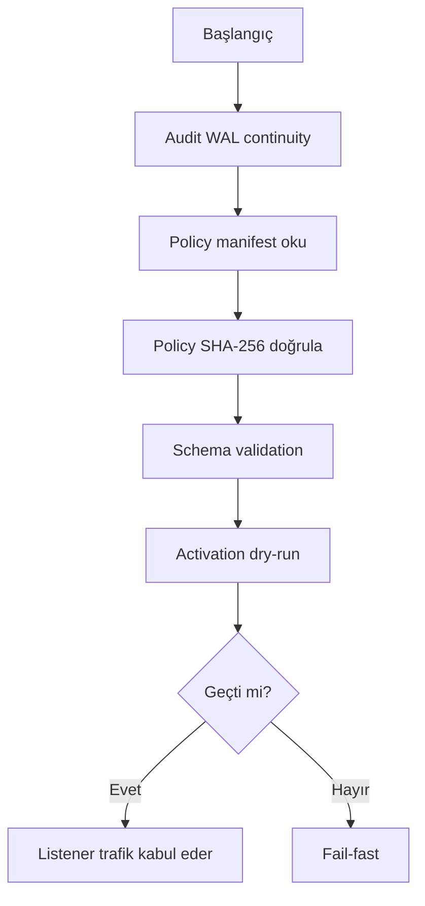
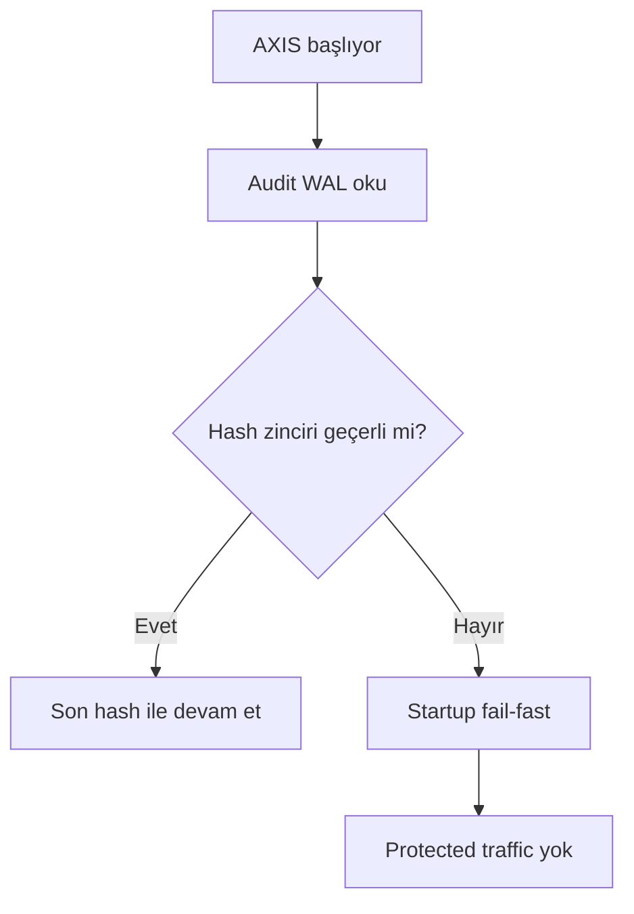
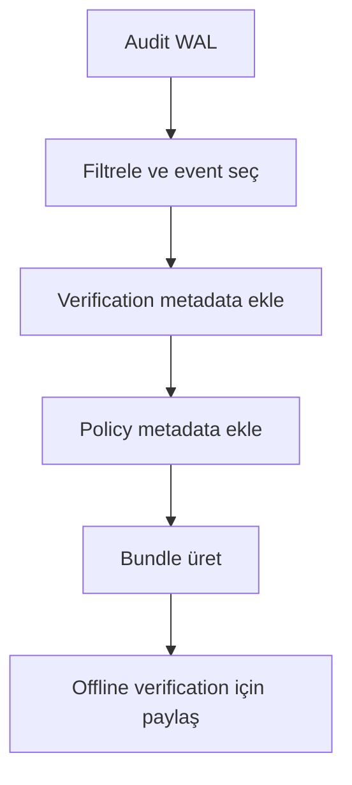

# Runtime Akışları

Bu dosya, AXIS'in temel runtime akışlarını ayrı ayrı gösterir. Diyagramlar basit tutulmuştur; amaç reviewer'ın execution öncesi karar ve evidence bağlantısını hızlıca görmesidir.

## 1. Safe READ allowed

Safe read, policy default veya explicit allow ile çalışabilir. Yine de request ve decision evidence üretilebilir.

## 2. Safe WRITE allowed

Scoped write, policy'de explicit allow varsa çalışabilir. Protected write için decision evidence execution öncesinde commit edilmelidir.

## 3. Risky WRITE requiring approval

Approval gereken write ilk istekte çalışmaz.

## 4. BLOCK flow

Block kararı PostgreSQL'e gitmez.

## 5. Approval resolve flow

Approve/reject final state üretir. Approve execution değildir; caller aynı request ile retry yapar.

## 6. Audit verification flow

Verification WAL'ı okur, event hash ve previous hash zincirini kontrol eder.

## 7. Startup policy integrity flow

Startup policy bütünlüğü doğrulanmadan trafik kabul edilmemelidir.

## 8. Corrupt audit fail-fast flow

Audit WAL bozuksa sistem güvenli başlamamalıdır.

## 9. Evidence export flow

Evidence export, seçilmiş event'leri ve verification metadata'yı taşınabilir hale getirir.

