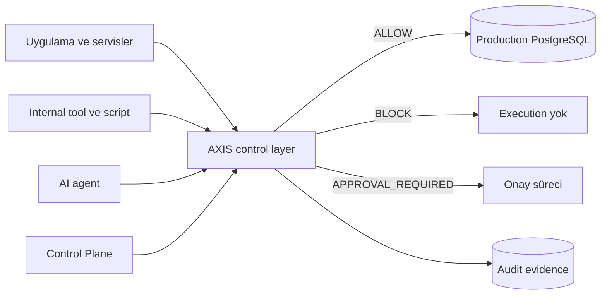

# Müşteri İçin Teknik Anlatım

AXIS, production veritabanı operasyonlarını çalışmadan önce policy ile değerlendiren bir kontrol katmanıdır. Amaç, yetkili sistemlerden gelen riskli write işlemlerini execution öncesinde durdurmak, onaya bağlamak veya kontrollü şekilde geçirmek ve bu kararları audit evidence ile kanıtlanabilir hale getirmektir.

## Neden önemlidir?

Production veritabanı riskleri sadece dış saldırıdan gelmez. Yanlış migration, hatalı admin script'i, geniş kapsamlı ORM query'si, internal tool bug'ı veya AI agent tarafından üretilen SQL de veri kaybına veya yanlış değişikliğe neden olabilir.

AXIS bu operasyonel riski azaltır:

- SQL'i çalışmadan önce inceler,
- write/delete/DDL risklerini sınıflandırır,
- policy kararı üretir,
- approval gereken işleri beklemeye alır,
- karar ve sonucu audit evidence olarak kaydeder.

## Altyapıda nereye oturur?

Mevcut repo, HTTP `/query` adapter modelini gösterir. Native PostgreSQL wire protocol desteği ayrı değerlendirilmesi gereken bir konudur.

## Execution öncesinde ne yapar?

AXIS şu kontrolleri yapar:

- request validation,
- SQL parse ve classification,
- operation, target, scope ve risk signal çıkarımı,
- active policy evaluation,
- `ALLOW`, `BLOCK` veya `REQUIRE_APPROVAL` kararı,
- protected write için audit decision evidence commit.

`BLOCK` veya `REQUIRE_APPROVAL` durumunda SQL ilk request'te PostgreSQL'e ulaşmaz.

## Execution sonrasında neyi kanıtlar?

AXIS audit evidence ile şunları göstermeyi hedefler:

- hangi request geldi,
- SQL fingerprint neydi,
- hangi policy versiyonu kullanıldı,
- hangi rule match etti,
- karar neydi,
- approval varsa hangi approval id ile bağlıydı,
- execution sonucu veya belirsizlik neydi,
- event hash zinciri tutarlı mı.

Bu kanıt modeli normal uygulama loglarından farklıdır; WAL ve hash-chain doğrulamasına dayanır.

## Operasyonel değer

AXIS şu alanlarda değer sağlar:

- destructive SQL riskinin azaltılması,
- risky write için explicit approval,
- policy değişikliklerinin daha kontrollü yürütülmesi,
- incident review için karar kanıtı,
- uygulama ve operatör hatalarının execution öncesinde yakalanması,
- customer pilotlarında protected write path'in gözlemlenmesi.

## Ne vaat etmez?

AXIS şu iddiaları yapmamalıdır:

- bütün database security kontrollerinin yerini alır,
- IAM/RBAC gereksizdir,
- backup ve monitoring gereksizdir,
- direct DB bypass mümkün değildir,
- compliance certification sağlar,
- local SHA-256 remote attestation demektir,
- her ORM veya her SQL shape otomatik desteklenir,
- native PostgreSQL wire protocol coverage mevcut HTTP adapter ile kanıtlanmıştır.

AXIS doğru deployment ve operator discipline ile anlam kazanır. Özellikle production'da database credentials, network path ve role separation AXIS güvenlik modelinin dış ama zorunlu parçalarıdır.

