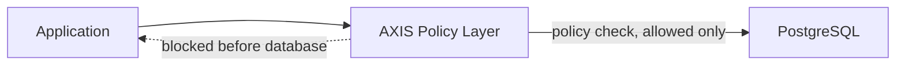

# Mimari Ozet

## Akis

- Uygulama normal veritabani istemcisi gibi baglanir.
- AXIS, gelen istegi en erken guvenli noktada siniflandirir.
- Policy sonucu izinliyse istek PostgreSQL'e gider.
- Policy sonucu engelleme ise istek PostgreSQL'e hic ulasmaz.
- Engelleme sonrasi hedef, baglantiyi uygulama acisindan kullanilabilir ve anlasilir durumda tutmaktir.

## Karar Noktasi

- Policy check, PostgreSQL islemi calistirmadan once yapilir.
- AXIS sadece izin verilen islemleri veritabanina ulastirmayi hedefler.
- Belirsiz veya desteklenmeyen durumlarda varsayilan davranis sessiz gecirmek degil, kontrollu reddetmektir.
