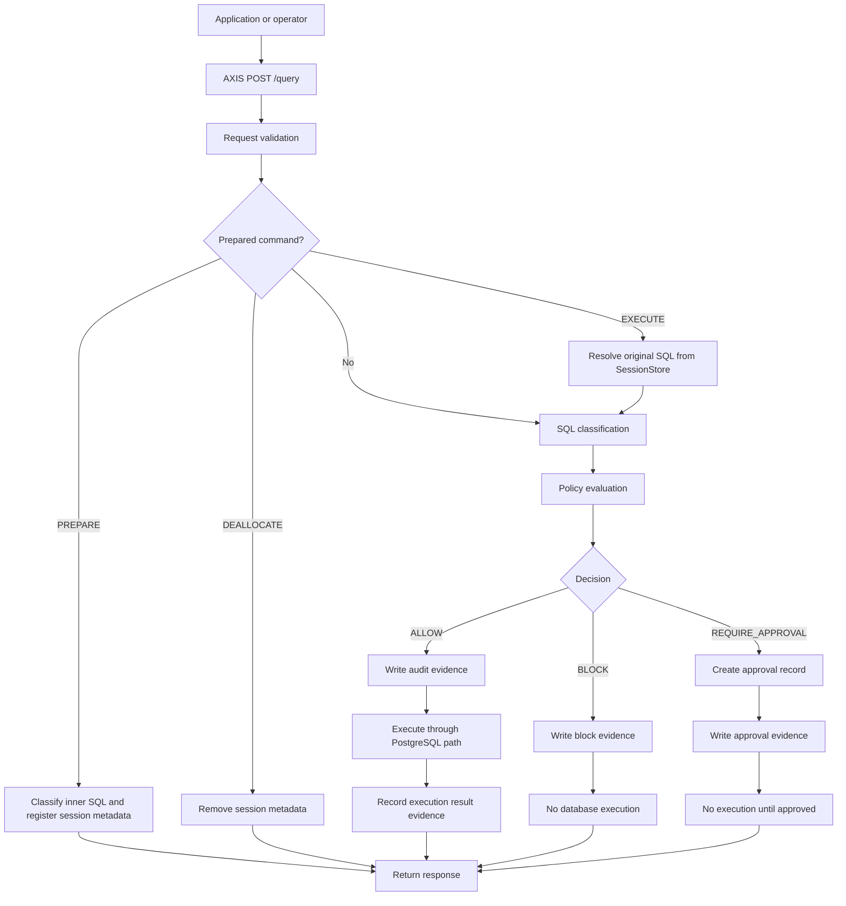
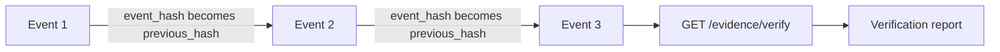
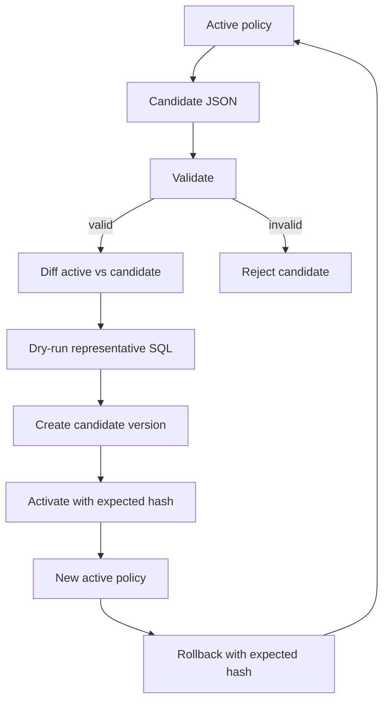

# AXIS Architecture Overview

## High-Level Purpose

AXIS is a deterministic control layer for PostgreSQL write paths. It sits between applications or operators and the database, classifies SQL, evaluates policy, enforces the decision, and records durable evidence.

The v0.6 package is designed for local technical review and pilot planning. It shows how the core enforcement, audit, approval, visibility, and policy lifecycle pieces fit together.

## Core Components

- Listener/API layer: Axum HTTP service exposing `/query`, approvals, audit, runtime, evidence, and policy lifecycle endpoints.
- SQL classification: PostgreSQL SQL parsing, normalization, fingerprinting, operation detection, target extraction, scope estimation, and risk signals.
- Session store: in-memory `session_id` scoped prepared statement metadata for AXIS-side `PREPARE`, `EXECUTE`, and `DEALLOCATE` enforcement.
- Policy engine: Versioned policy evaluation producing `ALLOW`, `BLOCK`, or `REQUIRE_APPROVAL`.
- Approval store: Local JSONL-backed pending and resolved approval records.
- Audit logger: WAL plus JSONL projection with event hashes and previous-hash linkage.
- Evidence verifier: Read-only hash-chain verification for audit evidence.
- Runtime log store: bounded in-memory operational log buffer exposed by `GET /logs`.
- Policy lifecycle store: Local immutable version files, active policy pointer, candidate state, validation, activation, and rollback.
- Runtime visibility endpoints: Health, runtime stats, runtime logs, audit explorer, policy status, and evidence verification.
- Control plane frontend: Next.js operator surface for dashboard, query console, approvals, audit, runtime, and policy lifecycle review.

## Request Decision Flow

Decision branches:

- `ALLOW`: AXIS writes decision evidence and executes through the configured PostgreSQL executor.
- `BLOCK`: AXIS writes block evidence and does not execute the SQL.
- `REQUIRE_APPROVAL`: AXIS creates an approval record, writes approval evidence, and does not execute until a later approval resolution.

Prepared statement branches:

- `PREPARE`: requires `session_id`, evaluates the inner SQL for risk context, registers AXIS-side metadata, writes audit evidence, and does not forward database-side `PREPARE`.
- `EXECUTE`: requires `session_id`, resolves the stored original SQL in that session, evaluates the original SQL through policy, and fails closed when unresolved.
- `DEALLOCATE` / `DEALLOCATE ALL`: require `session_id`, remove AXIS-side metadata, and write audit evidence.
- Allowed prepared `EXECUTE` is not blindly forwarded as raw PostgreSQL `EXECUTE` because HTTP sessions do not guarantee pooled backend connection affinity.

## Audit/Evidence Flow

Every important decision produces an audit event. AXIS records fields such as request identity, SQL fingerprint, operation, target, scope, risk signals, policy decision, final decision, reason code, matched rule, policy version, risk level, explanation, `previous_hash`, and `event_hash`.

Prepared statement decisions include `session_id` and prepared context fields when relevant: command, name, resolved flag, original SQL fingerprint, original operation/query type, and original risk level.

Evidence behavior:

- New events include a `previous_hash` pointer to the last committed event hash.
- Each event has an `event_hash` calculated from canonical event content.
- On restart, AXIS reads the final non-empty audit record and continues the chain from that hash.
- `GET /evidence/verify` recomputes event hashes and verifies linkage without mutating the log.
- Malformed records, missing hash fields, or mismatched hashes are reported as invalid evidence. AXIS does not silently repair evidence.

## Runtime Logs Flow

Runtime logs are operational visibility, not audit evidence. AXIS keeps a bounded in-memory `VecDeque` of safe summaries and exposes it through `GET /logs`.

Runtime log entries include a stable runtime id, UTC timestamp, level, category, message, request id, actor/app/tenant context when available, decision, risk, classification summary, reason, matched rule, SQL fingerprint, policy metadata, approval id, and bounded metadata. They do not expose raw audit WAL records, raw headers, database credentials, operator tokens, backend URLs, or raw SQL bodies.

Current runtime log events include:

- AXIS runtime started.
- Policy loaded.
- Policy dry-run passed.
- Query decision emitted.
- Approval created.
- Approval resolved or rejected.
- Safe runtime errors such as execution uncertainty or evidence commit failure summaries.

The Control Plane reads runtime logs through `/api/axis/logs`. Real mode does not fabricate log rows; it shows either returned logs, a stable empty state, or a controlled unavailable/error state.

## Policy Lifecycle Flow

Lifecycle behavior:

- The active policy is loaded from the lifecycle store when present, or initialized from `POLICY_PATH`.
- Candidate policies are validated before storage.
- Diff compares candidate behavior against the active policy.
- Dry-run reuses classifier and policy evaluation without SQL execution, audit writes, or approval creation.
- Prepared `EXECUTE` dry-run has no durable session store attached and therefore fails safe as unresolved unless a future caller supplies an isolated session context.
- Candidate versions are stored as immutable local files with hash metadata.
- Activation requires the candidate ID and expected hash, validates again, then swaps the in-memory active policy.
- Rollback requires a valid stored version and expected hash.
- Old versions are retained for review and rollback.

## Control Plane

The Next.js control plane under `control-plane/` provides:

- Dashboard: health, runtime status, integrity, and recent activity.
- Query console: direct `/query` evaluation against the configured backend.
- Approval center: pending approvals and resolution.
- Evidence explorer: recent audit events and event detail.
- Policy lifecycle page: active policy, validation, diff, dry-run, versions, activation, and rollback.
- Runtime page: service status, audit posture, limits, and evidence verification.
- Logs page: real runtime logs from `/api/axis/logs`, preserving previous rows during background refresh.

The control plane should show real backend state in real mode. Mock mode is explicit server-side demo behavior only, not production evidence.

## Trust Boundaries

- Application to AXIS: SQL, request identity fields, and environment labels are untrusted inputs unless the deployment adds identity controls.
- AXIS to database: AXIS is trusted to enforce policy before forwarding allowed SQL to PostgreSQL.
- AXIS session id to PostgreSQL backend session: not trusted as equivalent in v0.8. Prepared state is AXIS-side security metadata, not a guarantee of database connection affinity.
- Operator to control plane: v0.6 has local settings and an optional operator token for mutating lifecycle endpoints; it is not full RBAC.
- Audit/evidence store: local files are trusted for local review but are not an external tamper-proof ledger.
- Runtime log store: in-memory operational visibility only; it is not trusted as durable proof.
- Policy store: local policy files and manifests are trusted local state; hash checks detect accidental or simple tampering but do not replace external key management or signed policy distribution.

## Design Constraints

- Deterministic over probabilistic: policy decides; AXIS does not guess with AI.
- Fail-safe defaults: unsupported or dangerous SQL shapes should not silently pass.
- No silent policy downgrade: policy activation and rollback require validation and expected-hash checks.
- No dry-run mutation: dry-run never executes SQL, writes audit evidence, or creates approvals.
- Prepared statement fail-safe: unresolved, cross-session, malformed, or missing-session `EXECUTE` never becomes silent `ALLOW`.
- Audit integrity over convenience: malformed or corrupted evidence is reported instead of hidden.
- Visibility without fake data: operator views should expose real state when connected to a live backend.
# Policy Manifest Startup Path

AXIS v0.9 makes the deployed policy manifest the authoritative startup input. `AXIS_POLICY_DIR` defaults to `./policies`, and `AXIS_POLICY_MANIFEST` defaults to `./policies/policy_manifest.json`. The manifest points to the active policy file, declares the expected policy version, and stores the raw policy file SHA-256.

Startup order is:

1. Open and verify audit WAL continuity.
2. Load and validate the policy manifest.
3. Resolve and hash the active policy file.
4. Parse and validate the policy model.
5. Run the deterministic activation dry-run corpus.
6. Write policy lifecycle audit events.
7. Start accepting traffic.

The in-memory runtime state stores `ActivePolicy`, which combines the existing policy model with `ActivePolicyMetadata` (`policy_id`, `policy_version`, `policy_sha256`, manifest path, policy path, and load time). The evaluator still uses the existing deterministic policy engine; the metadata is carried into decisions, audit records, health, and policy status responses.

Controlled reload is internal-only in v0.9 and disabled by default. No HTTP reload endpoint is introduced.
